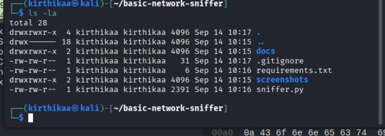
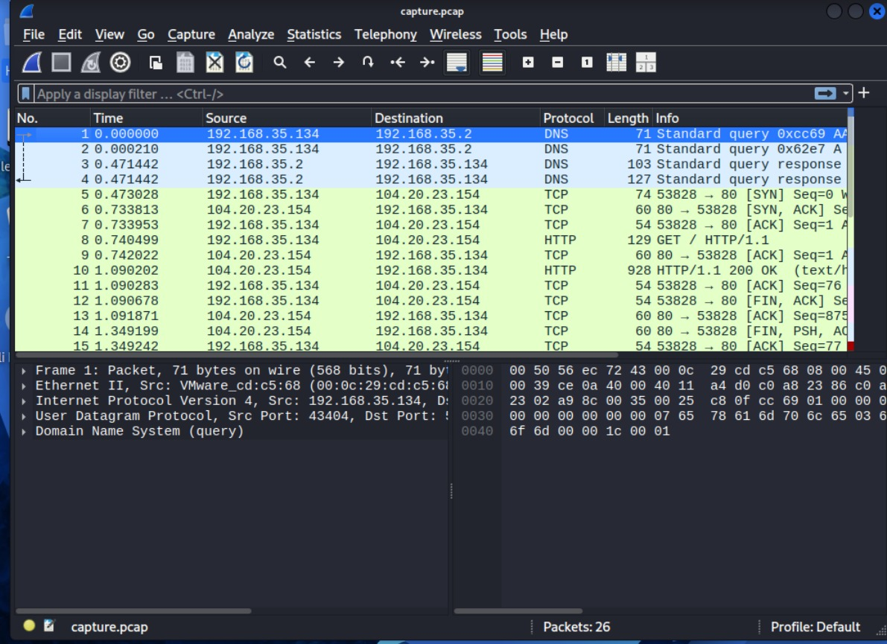
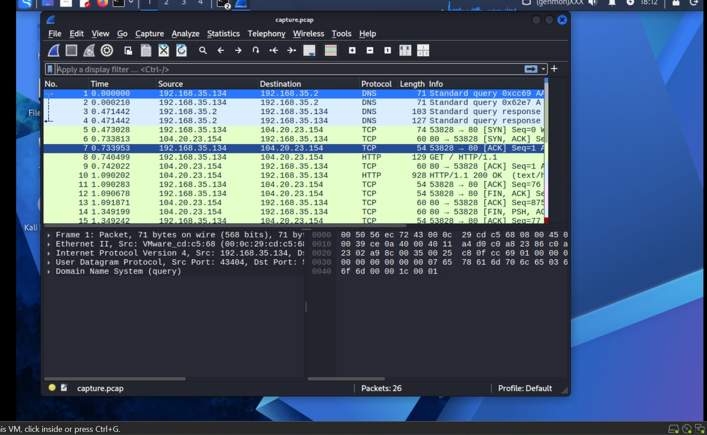
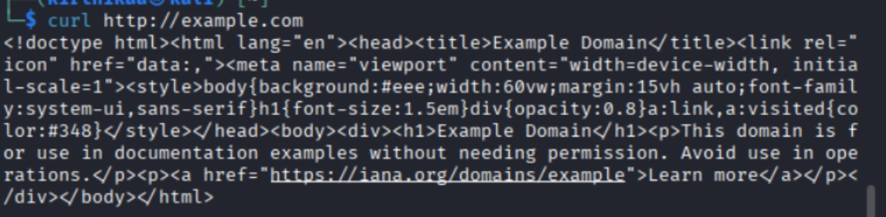

# Basic Network Sniffer

A basic network packet sniffer developed in Python using Scapy as part of my cybersecurity learning journey.

## 📌 Project Overview

This project captures and analyzes network packets in real time.

The sniffer identifies basic information about network traffic, including:

- Source IP address
- Destination IP address
- Protocol
- Packet length
- Source and destination ports
- Payload information

The project was developed and tested in a Kali Linux virtual machine.

## 🛠️ Technologies Used

- Python 3
- Scapy
- Kali Linux
- Wireshark
- VMware

## 🔍 Protocols Observed

During testing, the sniffer successfully captured and displayed:

- ICMP
- UDP
- TCP
- DNS
- HTTP

## 🧪 Testing

The project was tested using several network activities.

### ICMP

A ping request was generated to:

8.8.8.8

### DNS

DNS resolution was tested using:

nslookup example.com

The sniffer detected UDP traffic between the Kali Linux machine and the DNS server.

### HTTP

HTTP traffic was generated using:

curl http://example.com

The sniffer successfully captured the HTTP request and response.

Example captured HTTP request:

GET / HTTP/1.1
Host: example.com
User-Agent: curl/8.21.0
Accept: */*

Example captured TCP packet:

Source IP       : 192.168.35.134
Destination IP  : 104.20.23.154
Protocol        : TCP
Source Port     : 53828
Destination Port: 80

## Wireshark Analysis

Wireshark was used to verify and analyze the packets captured by the Python sniffer.

The capture demonstrated:

- DNS queries and responses
- TCP connection establishment
- HTTP GET request
- HTTP 200 OK response
- TCP connection termination

Screenshots from the Wireshark analysis are available in the screenshots directory.

## Disclaimer

This project was created for educational purposes and was tested on my own virtual machine and network traffic.

Do not use packet sniffing techniques on networks or systems without proper authorization.

## Learning Outcomes

Through this project, I gained practical experience with:

- Network packet analysis
- TCP/IP concepts
- DNS traffic
- HTTP traffic
- Python and Scapy
- Wireshark
- Network troubleshooting
- Basic cybersecurity monitoring

## Future Improvements

Possible improvements include:

- Add packet filtering
- Add interface selection
- Detect more protocols
- Improve payload analysis
- Add packet statistics
- Add command-line arguments
- Improve packet capture/export functionality

## 📸 Screenshots

### Network Sniffer Output

### Wireshark Analysis

### Wireshark Overview

### HTTP Response

